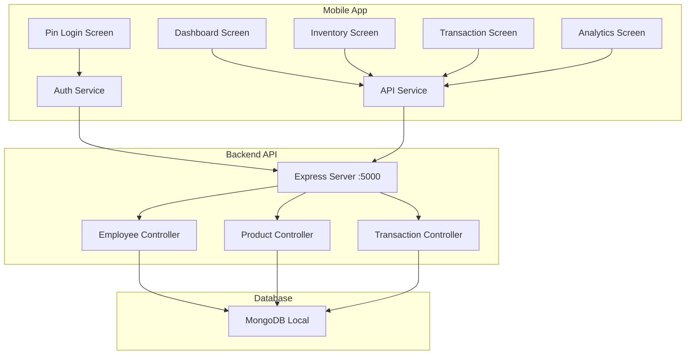

# Design Document: Mobile Local Database Connection

## Overview

This design document outlines the implementation for connecting the mobile application to the local MongoDB database through the backend API, implementing owner-only PIN authentication, and ensuring all data is properly fetched and displayed across the mobile app screens.

## Architecture



## Components and Interfaces

### 1. API Configuration (mobile/config/api.js)

The API configuration module manages the connection settings for the backend API.

```javascript
interface APIConfig {
  BASE_URL: string;      // Full base URL (e.g., http://192.168.1.6:5000)
  API_URL: string;       // API endpoint URL (e.g., http://192.168.1.6:5000/api)
}
```

### 2. API Service (mobile/services/api.js)

The API service provides methods for all API interactions.

```javascript
interface EmployeeAPI {
  verifyPin(pin: string, employeeId?: string): Promise<VerifyPinResponse>;
  verifyOwnerPin(pin: string): Promise<VerifyPinResponse>;
  getAll(): Promise<EmployeeListResponse>;
}

interface ProductAPI {
  getAll(params?: object): Promise<ProductListResponse>;
  getById(id: string): Promise<ProductResponse>;
  search(query: string): Promise<ProductListResponse>;
}

interface TransactionAPI {
  getAll(params?: object): Promise<TransactionListResponse>;
  getById(id: string): Promise<TransactionResponse>;
  getDashboardStats(): Promise<DashboardStatsResponse>;
}
```

### 3. PIN Login Component (mobile/app/pinlogin.tsx)

Handles owner-only authentication.

```typescript
interface PinLoginState {
  pin: string;
  isLoading: boolean;
  errorMessage: string;
  showModal: boolean;
}

interface VerifyPinResponse {
  success: boolean;
  message: string;
  data: Employee | null;
  requiresPinReset?: boolean;
}
```

### 4. Dashboard Component (mobile/app/(tabs)/index.jsx)

Displays owner welcome message and dashboard statistics.

### 5. Inventory Component (mobile/app/(tabs)/inventory.jsx)

Displays product list with stock information.

### 6. Transaction Component (mobile/app/(tabs)/transaction.jsx)

Displays transaction history with search and filtering.

## Data Models

### Employee Model
```javascript
{
  _id: ObjectId,
  firstName: string,
  lastName: string,
  name: string,
  email: string,
  role: "Owner" | "Staff" | "Manager",
  pin: string (hashed),
  status: "Active" | "Inactive",
  profileImage: string,
  permissions: object,
  requiresPinReset: boolean
}
```

### Product Model
```javascript
{
  _id: ObjectId,
  name: string,
  sku: string,
  brand: string,
  category: string,
  price: number,
  stock: number,
  itemImage: string,
  dateAdded: Date,
  createdAt: Date,
  updatedAt: Date
}
```

### Transaction Model
```javascript
{
  _id: ObjectId,
  receiptNo: string,
  items: Array<TransactionItem>,
  totalAmount: number,
  discountAmount: number,
  paymentMethod: string,
  status: "Completed" | "Voided" | "Returned",
  performedByName: string,
  createdAt: Date
}
```

## Correctness Properties

*A property is a characteristic or behavior that should hold true across all valid executions of a system-essentially, a formal statement about what the system should do. Properties serve as the bridge between human-readable specifications and machine-verifiable correctness guarantees.*

### Property 1: API URL Construction
*For any* API configuration with a valid IP address and port, the constructed API_URL should be the BASE_URL concatenated with "/api"
**Validates: Requirements 1.1**

### Property 2: Owner Role Access Grant
*For any* employee with role "Owner" and valid PIN, the verifyOwnerPin function should return success: true and include the employee data
**Validates: Requirements 2.2**

### Property 3: Non-Owner Role Access Denial
*For any* employee with role other than "Owner" (e.g., "Staff", "Manager"), the verifyOwnerPin function should return success: false with message "Only owner account can access the mobile app"
**Validates: Requirements 2.3**

### Property 4: Invalid PIN Rejection
*For any* PIN that does not match any active employee, the verifyPin function should return success: false
**Validates: Requirements 2.4**

### Property 5: Product Display Completeness
*For any* product fetched from the API, the rendered product item should contain name, SKU, brand, category, price, and stock quantity
**Validates: Requirements 3.2**

### Property 6: Low Stock Highlighting
*For any* product with stock quantity less than 5, the stock display should use a red/warning color indicator
**Validates: Requirements 3.3**

### Property 7: Transaction Display Completeness
*For any* transaction fetched from the API, the rendered transaction item should contain receipt number, cashier name, items list, status, total amount, and date
**Validates: Requirements 4.2**

### Property 8: Transaction Search Filtering
*For any* search query, the filtered transaction results should only include transactions where receipt number, date, or status contains the search query (case-insensitive)
**Validates: Requirements 4.3**

### Property 9: Dashboard Owner Name Display
*For any* logged-in owner, the dashboard welcome message should include the owner's firstName or name
**Validates: Requirements 5.1**

### Property 10: Chart View Data Consistency
*For any* chart type selection (daily, monthly, yearly), the displayed chart data should correspond to the selected time period
**Validates: Requirements 6.2**

## Error Handling

### Network Errors
- Display user-friendly error messages when API is unreachable
- Provide retry functionality through pull-to-refresh
- Store error state to prevent repeated failed requests

### Authentication Errors
- Clear PIN input on failed authentication
- Display specific error messages for different failure types
- Prevent navigation until successful authentication

### Data Loading Errors
- Show loading indicators during data fetch
- Display empty state messages when no data available
- Handle partial data gracefully

## Testing Strategy

### Unit Testing
- Test API URL construction logic
- Test PIN validation logic
- Test data normalization functions
- Test search/filter functions

### Property-Based Testing
The project will use **fast-check** for property-based testing in JavaScript/TypeScript.

Each property-based test must:
- Run a minimum of 100 iterations
- Be tagged with the format: `**Feature: mobile-local-database-connection, Property {number}: {property_text}**`
- Reference the correctness property from this design document

### Integration Testing
- Test API service methods with mock responses
- Test component rendering with various data states
- Test navigation flow after authentication
